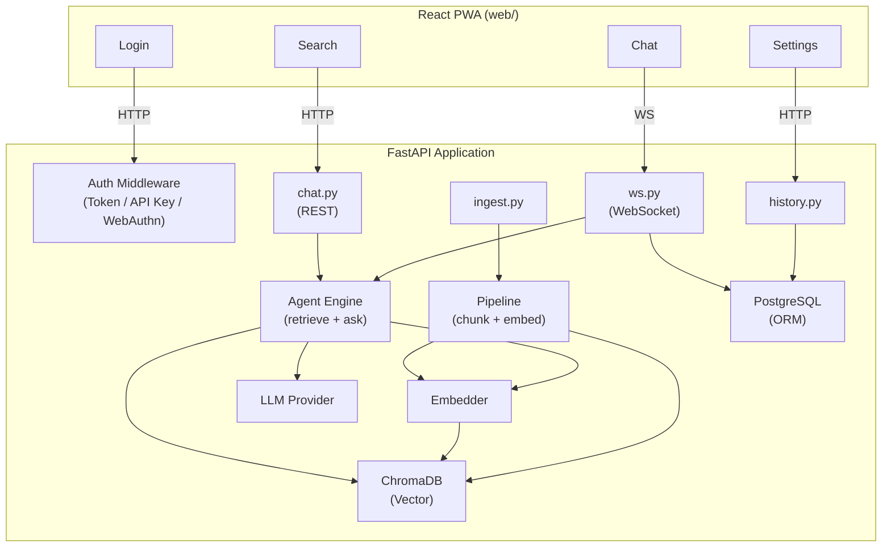
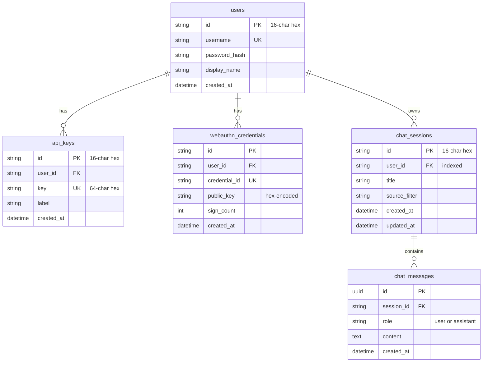
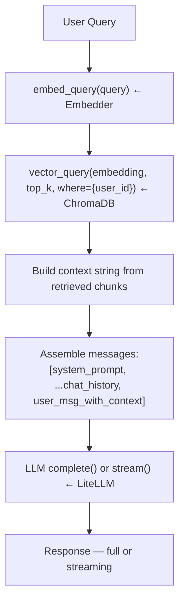
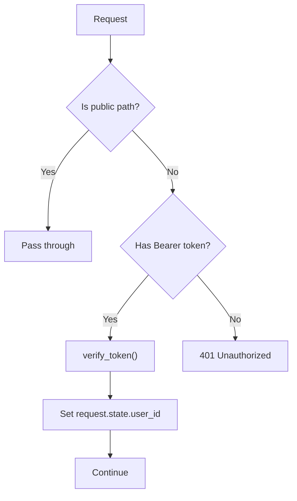
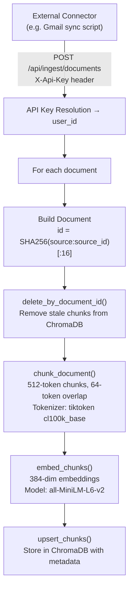
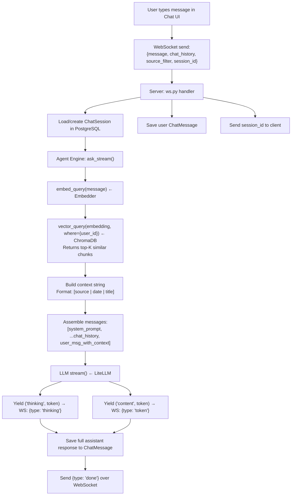
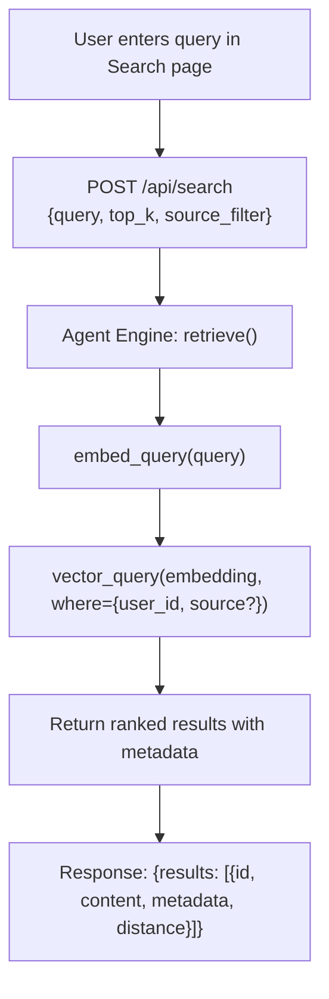
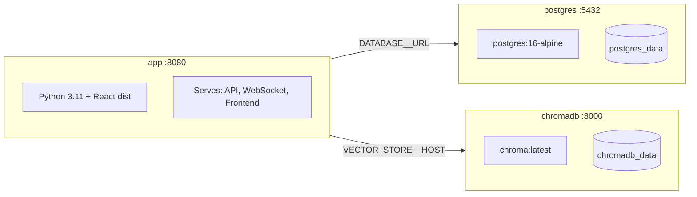

# MindPalace — Design Document

## 1. Overview

MindPalace is a personal Retrieval-Augmented Generation (RAG) system that lets users index their digital content (emails, notes, bookmarks, documents, photos) and query it through a conversational AI interface. The system combines vector-based semantic search with LLM reasoning to answer questions grounded in the user's own data.

### Design Goals

- **Personal-first**: All data is scoped per user; multi-tenant by design
- **Source-agnostic ingestion**: A uniform document model accepts content from any external connector via API
- **Streaming UX**: Real-time token-by-token response delivery over WebSocket
- **Minimal infrastructure**: Three containers (app, PostgreSQL, ChromaDB) via Docker Compose
- **Extensible LLM layer**: Swap models or providers without code changes via LiteLLM

---

## 2. High-Level Architecture



### Component Summary

| Component | Responsibility |
|-----------|---------------|
| **React PWA** | Chat UI, search, settings, auth; communicates over HTTP and WebSocket |
| **FastAPI App** | HTTP/WS server with auth middleware, route handlers |
| **Agent Engine** | Orchestrates RAG: retrieval → context building → LLM completion |
| **Pipeline** | Chunks documents into token-bounded segments and computes embeddings |
| **LLM Provider** | Thin wrapper around LiteLLM for completion and streaming |
| **Embedder** | sentence-transformers model for query and document embedding |
| **ChromaDB** | Vector store for chunk embeddings and metadata |
| **PostgreSQL** | Relational store for users, auth credentials, chat sessions, messages |

---

## 3. Data Model

### 3.1 Relational Schema (PostgreSQL)



- All IDs are 16-character hex strings derived from `uuid4().hex[:16]`
- `password_hash` uses bcrypt with automatic salting
- `webauthn_credentials.public_key` stored as hex-encoded bytes
- `sign_count` is incremented on each passkey use to detect cloning

### 3.2 Document Model (In-Memory / ChromaDB)

Documents are transient Python dataclasses used during ingestion; they are not persisted in PostgreSQL.

```python
ContentType: EMAIL | NOTE | CHECKLIST | BOOKMARK | DOCUMENT | PHOTO

Document:
  source        # origin system: gmail, google_keep, chrome_bookmarks, etc.
  source_id     # unique ID within the source system
  title, content, content_type
  user_id       # owner
  url, metadata # optional enrichment
  created_at, updated_at, ingested_at, expires_at

  id = SHA256(f"{source}:{source_id}")[:16]   # deterministic, dedup-safe
```

A `Document` is split into one or more `Chunk` objects:

```python
Chunk:
  document_id, chunk_index, total_chunks
  content                  # text segment
  embedding                # float vector (384-dim for MiniLM)
  # denormalized from parent Document:
  source, source_id, content_type, title, url,
  created_at, ingested_at, user_id, expires_at
```

Chunks are stored in ChromaDB with their embedding and a metadata dict for filtering.

### 3.3 Vector Store Schema (ChromaDB)

- **Collection**: `mindpalace` (configurable)
- **Distance metric**: Cosine similarity (`hnsw:space = cosine`)
- **Per-chunk fields**:
  - `id` — `{document_id}_{chunk_index}`
  - `document` — chunk text (also used for BM25 fallback)
  - `embedding` — 384-dimensional float vector
  - `metadata` — flat dict with all `Chunk` fields for filtering (`user_id`, `source`, `content_type`, `document_id`, etc.)

---

## 4. Module Design

### 4.1 Configuration (`mindpalace/config.py`)

Uses Pydantic Settings with nested model classes:

```
Settings
├── vector_store: VectorStoreSettings (host, port, collection)
├── embedding: EmbeddingSettings (model, device, batch_size)
├── llm: LLMSettings (model, api_key, temperature, max_tokens, base_url, fallback_model)
├── rag: RAGSettings (top_k, rerank_top_k, chunk_size, chunk_overlap)
├── database: DatabaseSettings (url)
├── auth_secret: str
├── webauthn_rp_id: str
└── webauthn_origin: str
```

Environment variables use `__` as the nesting delimiter (e.g. `LLM__API_KEY`). A `.env` file is loaded automatically.

### 4.2 Database Layer (`mindpalace/db.py`)

- SQLAlchemy ORM with declarative base
- Lazy-initialized engine with `pool_pre_ping=True` for connection health
- `get_db()` generator for FastAPI dependency injection (auto commit/rollback)
- `init_db()` called on app startup to create tables

### 4.3 Pipeline (`mindpalace/pipeline/`)

#### Chunker (`chunker.py`)

Splits document text into token-bounded chunks using tiktoken (`cl100k_base` encoding, same tokenizer as GPT-4).

**Algorithm:**
1. Try splitting on separators in priority order: `\n\n`, `\n`, `. `, ` `
2. Use the first separator that produces multiple parts
3. Greedily merge parts until the token limit is reached
4. Maintain overlap by re-including the last N tokens from the previous chunk
5. Fall back to character-level splitting if no separator works

**Defaults:** 512 tokens per chunk, 64 tokens overlap.

#### Embedder (`embedder.py`)

- Lazily loads a `SentenceTransformer` model (default: `all-MiniLM-L6-v2`, 384 dimensions)
- `embed_chunks(chunks)` — batch-embeds all chunks, assigns `chunk.embedding`
- `embed_query(query)` — embeds a single query string for retrieval
- Configurable batch size and device (CPU by default)

### 4.4 Vector Store (`mindpalace/store/vectordb.py`)

Thin client over ChromaDB's HTTP API:

- `upsert_chunks(chunks)` — inserts or updates chunks with ids, embeddings, documents, and metadata
- `query(embedding, top_k, where)` — cosine similarity search with optional metadata filters
- `delete_by_document_id(doc_id)` — removes all chunks for a document (used before re-ingestion)
- `get_document_chunks(doc_id)` — retrieves all chunks for a document, sorted by index
- `get_stats()` — returns collection name and total chunk count

All query operations accept a `where` clause for user and source scoping.

### 4.5 LLM Provider (`mindpalace/llm/provider.py`)

Wraps LiteLLM for model-agnostic LLM access:

- `complete(messages)` — synchronous completion, returns full response string
- `stream(messages)` — async generator yielding `(type, token)` tuples:
  - `("content", token)` for regular response tokens
  - `("thinking", token)` for reasoning/chain-of-thought content (supported by some models)
- Automatic fallback to `fallback_model` on errors if configured
- Passes through `temperature`, `max_tokens`, `api_key`, `base_url` from settings

### 4.6 Agent Engine (`mindpalace/agent/engine.py`)

Orchestrates the RAG pipeline:



**Key functions:**

- `retrieve(query, top_k, where, user_id)` — embeds query, searches vector store with user scoping, returns ranked results
- `ask(query, chat_history, where, user_id)` — retrieves context then calls LLM for a complete response
- `ask_stream(query, chat_history, where, user_id)` — same as `ask` but yields tokens as an async iterator

**System prompt** instructs the model to act as a personal assistant, cite sources, and acknowledge when information is unavailable.

**User scoping:** The `user_id` is always injected into the ChromaDB `where` filter, ensuring a user can only retrieve their own data.

### 4.7 API Layer (`mindpalace/api/`)

#### Application (`main.py`)

- Creates FastAPI app with CORS (all origins allowed)
- Custom middleware intercepts requests to `/api/*` and verifies Bearer tokens
  - Exceptions: public auth endpoints, health check, ingest (uses API Key), static assets
- Mounts built frontend static files at `/assets`
- SPA fallback: any non-API, non-file request returns `index.html`
- Startup hook calls `init_db()` to ensure tables exist

#### WebSocket (`ws.py`)

Handles streaming chat at `/ws/chat`:

1. Client connects with `?token=xxx` query parameter
2. Server verifies token and extracts `user_id`
3. Client sends JSON: `{message, chat_history, source_filter, session_id}`
4. Server loads or creates a `ChatSession` in PostgreSQL
5. User message is saved to `chat_messages`
6. Server sends `{type: "session_id", content: id}` to client
7. `ask_stream()` is called; tokens are forwarded as:
   - `{type: "thinking", content: token}` — reasoning tokens
   - `{type: "token", content: token}` — response tokens
8. Full assistant response is saved to `chat_messages`
9. Server sends `{type: "done"}`

#### Routes

**`auth.py`** — Authentication and credential management:

| Endpoint | Description |
|----------|-------------|
| `POST /api/auth/register` | Create account (username ≥ 3, password ≥ 6 chars) |
| `POST /api/auth/login` | Login with username/password |
| `GET /api/auth/check` | Validate current token |
| `POST /api/auth/api-keys` | Create API key |
| `GET /api/auth/api-keys` | List user's API keys |
| `DELETE /api/auth/api-keys/{id}` | Revoke API key |
| `POST /api/auth/webauthn/register/begin` | Start passkey registration |
| `POST /api/auth/webauthn/register/complete` | Complete passkey registration |
| `POST /api/auth/webauthn/login/begin` | Start passkey authentication |
| `POST /api/auth/webauthn/login/complete` | Complete passkey authentication |
| `GET /api/auth/webauthn/status` | Check if user has registered passkeys |

Token format: `user_id:unix_timestamp:hmac_signature` with 30-day TTL.

**`chat.py`** — REST endpoints for non-streaming chat and search:

| Endpoint | Description |
|----------|-------------|
| `POST /api/chat` | Non-streaming chat (calls `ask()`) |
| `POST /api/search` | Semantic search (calls `retrieve()`) |
| `GET /api/stats` | Collection statistics |
| `GET /api/health` | Health check |

**`history.py`** — Chat session CRUD:

| Endpoint | Description |
|----------|-------------|
| `GET /api/chats` | List sessions (ordered by `updated_at` DESC) |
| `POST /api/chats` | Create session |
| `GET /api/chats/{id}` | Get session with messages |
| `PATCH /api/chats/{id}` | Update session title |
| `DELETE /api/chats/{id}` | Delete session and messages |
| `POST /api/chats/{id}/messages` | Add message to session |

**`ingest.py`** — Document ingestion (API Key auth via `X-Api-Key` header):

| Endpoint | Description |
|----------|-------------|
| `POST /api/ingest/documents` | Ingest documents (chunk → embed → upsert) |
| `DELETE /api/ingest/documents` | Delete document by source + source_id |

Ingestion pipeline per document:
1. Build `Document` from payload
2. `delete_by_document_id()` to remove stale chunks
3. `chunk_document()` to split into token-bounded segments
4. `embed_chunks()` to compute embeddings
5. `upsert_chunks()` to store in ChromaDB

---

## 5. Frontend Architecture

### 5.1 Technology

- React 19 with TypeScript
- Vite for bundling and dev server
- React Router DOM 7 for client-side routing
- react-markdown with remark-gfm and rehype-highlight for message rendering
- PWA with service worker and web app manifest

### 5.2 Pages

| Page | Purpose |
|------|---------|
| `Login` | Username/password login, registration, passkey authentication |
| `Chat` | Streaming chat with WebSocket, source filter, thinking display, message history |
| `Search` | Semantic search with source filter chips, expandable results |
| `Settings` | API key creation, listing, and revocation |
| `Sources` | Read-only overview of connected data sources and collection stats |

### 5.3 App Shell (`App.tsx`)

The main component manages global state:
- Authentication check on mount
- Sidebar with navigation, chat session list, and passkey setup prompt
- Active session tracking and Chat component remounting on session switch
- Session CRUD operations (create, load, delete)

### 5.4 API Client (`api.ts`)

Centralized API client with:
- Typed request/response interfaces for all endpoints
- `authHeaders()` for token injection
- `createChatWebSocket()` for WebSocket connections with token in query params
- Source registry: predefined list of supported sources with labels, icons, and colors

### 5.5 Auth Client (`auth.ts`)

Token management via `localStorage` (`mindpalace_token` key):
- `login()` / `register()` — basic auth flows
- `registerPasskey()` — full WebAuthn registration with browser credential creation
- `loginWithPasskey()` — WebAuthn authentication flow
- Base64URL encoding helpers for WebAuthn binary data

### 5.6 Service Worker (`sw.js`)

Cache-first strategy for the app shell, network-first for API calls:
- Caches `index.html` on install
- API and WebSocket requests bypass cache
- Static assets use network-first with cache fallback

---

## 6. Authentication Design

Three authentication mechanisms, each suited to a different use case:

### 6.1 Token-Based Auth (Primary)

- User logs in with username/password
- Server returns an HMAC-signed token: `user_id:timestamp:signature`
- Token is sent as `Authorization: Bearer <token>` on HTTP or `?token=<token>` on WebSocket
- TTL: 30 days from issuance
- Verification: recompute HMAC with `AUTH_SECRET` and compare

### 6.2 API Key Auth (Ingestion)

- Users generate API keys from the Settings page
- Keys are 64-character random hex strings, stored in PostgreSQL
- Used exclusively for `/api/ingest/*` endpoints via `X-Api-Key` header
- Allows external connectors/scripts to push data without exposing the user's session token

### 6.3 WebAuthn / Passkeys (Biometric)

- Optional passwordless login via platform authenticators (Touch ID, Face ID, Windows Hello)
- Registration stores `credential_id` and `public_key` in the database
- Login verifies the assertion against stored credentials
- Sign count tracking for clone detection
- Challenges stored in-memory (server-side, per-request)

### Auth Middleware Flow



---

## 7. Data Flow

### 7.1 Ingestion Flow



### 7.2 Query Flow (Streaming Chat)



### 7.3 Search Flow



---

## 8. Deployment Architecture

### Docker Compose Setup



### Multi-Stage Dockerfile

1. **Frontend build stage** (Node 20 slim): installs npm deps, runs `npm run build`, outputs `web/dist/`
2. **Backend stage** (Python 3.11 slim): installs pip deps, copies source code, copies frontend build, runs uvicorn

The app container serves both the API and the built frontend from a single process. Vite's dev server proxy is used only during local development.

### Networking

- All three containers communicate on the default Docker Compose network
- The app references `postgres` and `chromadb` by container hostname
- Only port 8080 needs to be exposed externally

---

## 9. Security Considerations

| Area | Implementation |
|------|---------------|
| **Password storage** | bcrypt with automatic salting |
| **Token signing** | HMAC-SHA256 with server-side secret (`AUTH_SECRET`) |
| **Token TTL** | 30-day expiry checked on every request |
| **Data isolation** | All vector queries include `user_id` in the `where` clause |
| **API key storage** | 64-char random hex, stored as-is (single-use display on creation) |
| **WebAuthn** | Per-request challenges, sign count validation, public key verification |
| **Input validation** | Pydantic models for request validation; username/password length checks |
| **CORS** | Configured at the middleware level (currently allows all origins) |
| **Session ownership** | All chat session operations verify `user_id` ownership |

---

## 10. Supported Content Sources

| Source Key | Label | Content Types |
|-----------|-------|---------------|
| `gmail` | Gmail | Emails |
| `google_keep` | Google Keep | Notes, Checklists |
| `chrome_bookmarks` | Chrome Bookmarks | Bookmarks |
| `google_drive` | Google Drive | Documents |
| `google_photos` | Google Photos | Photos |
| `local_photos` | Local Photos | Photos |

Sources are ingested via external connectors that push data through the `/api/ingest/documents` endpoint using an API key. The system is source-agnostic — any connector that produces the `DocumentPayload` schema can feed data into MindPalace.
